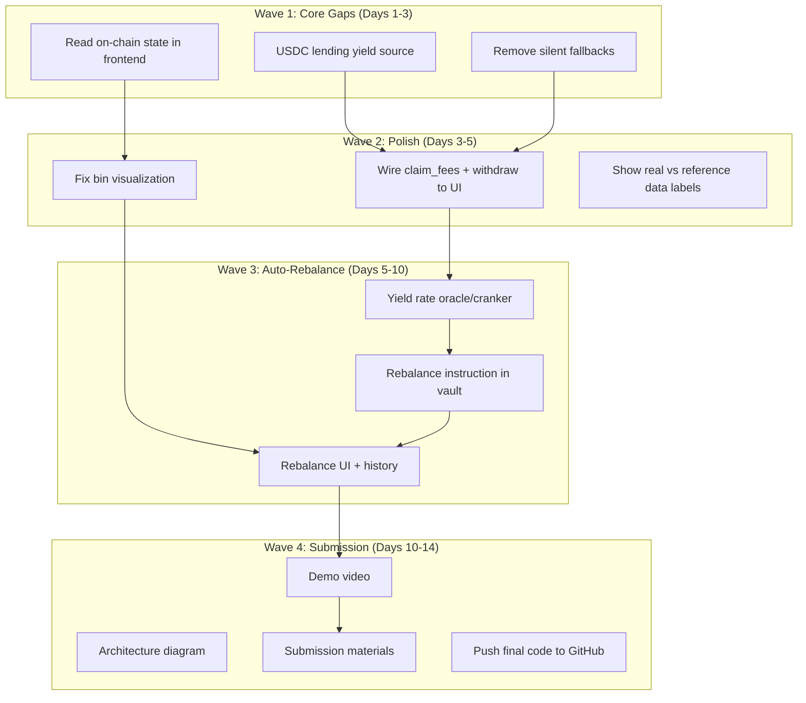

# HasYield — Remaining Work Plan

## Current State (as of Apr 17)

**What's REAL on devnet:**
- Meteora DLMM CPI (deposit/withdraw/claim fees) — proven
- Marinade staking CPI (SOL→mSOL) — proven
- Lending pool (collateral/borrow/repay) — deployed
- hyLP Token-2022 with transfer hook — deployed
- Frontend deposit/withdraw/borrow wired to on-chain — working

**What's FAKE/MISSING:**
- USDC lending yield (Solend code exists, no devnet reserve)
- Frontend reads simulated state, not on-chain
- Silent fallback on errors hides real failures
- No auto-rebalance
- No demo video or submission materials
- Fee counter is simulated (ticks in JS, not from chain)

## Deadline

**May 11, 2026** — 24 days remaining

## Work Phases (parallelizable by wave)

---

## Wave 1: Core Gaps (parallel, 2-3 days)

### Task 1A: USDC Lending Yield Source
**Problem:** The "triple yield" pitch requires three real yield sources. USDC lending is missing.
**Approach:** Create a simple `YieldVault` in our lending program — the vault deposits idle USDC, earns a configurable APR. This is our own protocol's lending yield, not external CPI. Honest labeling: "HasYield Lending Pool."
**Why not Solend:** Devnet reserve creation is blocked by undocumented config byte layout. The CPI code is deployed as proof of extensibility.

**Files:**
- Modify: `programs/lending/src/lib.rs` — add `deposit_borrow_liquidity` admin seeding
- Create: `scripts/seed-lending-pool.ts` — deposit initial USDC liquidity so borrow works
- Modify: `programs/lp-vault/src/lib.rs` — add `route_usdc_to_lending` instruction (vault PDA deposits USDC to lending pool)

**Verification:** E2E: deposit SOL → vault routes USDC portion to lending pool → lending pool has liquidity → borrow works

### Task 1B: Read On-Chain State in Frontend
**Problem:** Frontend shows `positionValue`, `feesEarned`, `borrowed` from React state, not from chain. Judges can't verify real state.

**Files:**
- Modify: `hasyield-app/src/app/vault/page.tsx`
- Create: `hasyield-app/src/lib/on-chain-reader.ts`

**What to read:**
- `vault_config` account → `total_deposited_x`, `total_deposited_y`, `total_shares`
- User's hyLP balance → `getTokenAccountBalance(userHylpAta)`
- `loan_position` account → `collateral_deposited`, `borrowed_amount`
- Vault mSOL balance → `getTokenAccountBalance(vaultMsolAta)`
- User's SOL balance → `getBalance`

**Approach:** `useEffect` on wallet connection + polling every 10s. Replace simulated state with on-chain reads.

### Task 1C: Remove Silent Fallbacks
**Problem:** Lines 255, 317 in vault page — on error, the UI silently shows success (simulated state). Judges test with real wallets; hiding errors is worse than showing them.

**Files:**
- Modify: `hasyield-app/src/app/vault/page.tsx`

**Approach:** Remove `setStage("position")` from catch blocks. Show toast error and stay on current stage. Only advance stage on real transaction success.

---

## Wave 2: Frontend Polish (parallel, 2 days)

### Task 2A: Wire Claim Fees + Withdraw to UI Buttons
**Problem:** "Claim Fees" has no UI button. "Withdraw" works in code but position view lacks obvious UX.

**Files:**
- Modify: `hasyield-app/src/app/vault/page.tsx`

**Approach:** Add "Harvest Fees" button in position view (stage=position). Show last harvest amount. The `claim_fees` instruction is already deployed.

### Task 2B: Fix Bin Visualization
**Problem:** Bins use `Math.random()` heights. Not representative of actual DLMM position.

**Files:**
- Modify: `hasyield-app/src/app/vault/page.tsx`

**Approach:** Either read real bin data from DLMM position account, OR generate deterministic distribution based on `SpotImBalanced` strategy around active bin. Label as "estimated distribution."

### Task 2C: Honest Data Labels
**Problem:** APY shows "35.0% APY" without context. Pool stats show mainnet data on devnet.

**Files:**
- Modify: `hasyield-app/src/app/vault/page.tsx`
- Modify: `hasyield-app/src/lib/meteora.ts`

**Approach:**
- Label pool APY as "Mainnet ref. APY" clearly
- Label Marinade rate as "Live rate (Marinade API)"
- Show "Devnet demo — reference rates from mainnet" banner
- Remove fake $2.1M TVL, $842K volume if not from real API

---

## Wave 3: Auto-Rebalance (3-5 days)

### Task 3A: Yield Rate Cranker
**Problem:** No mechanism to compare yield rates and decide reallocation.

**Files:**
- Create: `scripts/rebalance-cranker.ts`
- Create: `hasyield-app/src/lib/yield-rates.ts`

**Approach:** TypeScript cranker that:
1. Fetches Marinade APY from API
2. Fetches lending pool utilization and implied APR
3. Compares rates
4. Calls `rebalance` instruction if delta > threshold

### Task 3B: Rebalance Instruction
**Problem:** No on-chain instruction to shift capital between protocols.

**Files:**
- Modify: `programs/lp-vault/src/lib.rs`

**Approach:** `rebalance(target_marinade_bps: u16)` — admin/cranker instruction that:
1. Withdraws from Marinade if reducing staking allocation
2. Deposits to Marinade if increasing staking allocation
3. Updates vault config with current allocation
4. Emits event with old/new allocation for frontend

### Task 3C: Rebalance UI + History
**Problem:** No UI to show rebalance decisions or history.

**Files:**
- Modify: `hasyield-app/src/app/vault/page.tsx`

**Approach:** Show "Last rebalance: X% → Y% staking, Z hours ago" in position view. Show protocol allocation pie chart.

---

## Wave 4: Submission Materials (2-3 days)

### Task 4A: Demo Video
- Record browser flow: landing → connect wallet → deposit SOL → see hyLP + mSOL → borrow → repay → withdraw
- Show Solscan/Explorer to prove on-chain transactions
- 2-3 minutes max

### Task 4B: Architecture Diagram
- Create visual diagram showing vault PDA → DLMM / Marinade / Lending
- Use Excalidraw or similar
- Include in README and submission

### Task 4C: Submission Materials
- Project description (short + long)
- Track alignment (DeFi)
- Sponsor prize eligibility
- Team info
- Links (GitHub, demo, video)

### Task 4D: Final Push
- Clean up any remaining TODO comments
- Update both READMEs with final state
- Tag release
- Push to GitHub

---

## Parallel Execution Map

| Day | Agent 1 (Programs) | Agent 2 (Frontend) | Agent 3 (Content) |
|-----|-------------------|--------------------|--------------------|
| 1-2 | Task 1A: USDC lending yield | Task 1B: On-chain reads | Task 1C: Remove fallbacks |
| 3-4 | Task 2A: Claim fees button | Task 2B: Bin visualization | Task 2C: Data labels |
| 5-7 | Task 3B: Rebalance instruction | Task 3A: Cranker script | — |
| 8-9 | Task 3B: Testing | Task 3C: Rebalance UI | — |
| 10-11 | Final deploy + test | — | Task 4A: Demo video |
| 12-13 | Task 4D: Final push | — | Task 4B+4C: Submission |

## Risk Assessment

| Risk | Impact | Mitigation |
|------|--------|-----------|
| Solend devnet reserve still blocked | Low — we have 2 real CPIs + own lending | Label honestly, Solend code proves extensibility |
| Auto-rebalance too complex | Medium | Keep it simple — admin-triggered, not fully autonomous |
| USDC balance = 0 for borrow demo | Medium | Seed lending pool with test USDC in setup script |
| Demo video quality | Low | Screen record with OBS, keep it short |
